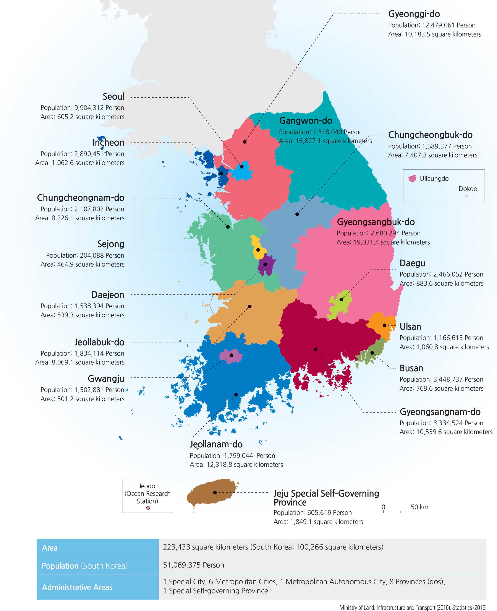

```{r setup, include=FALSE}
knitr::opts_chunk$set(echo = FALSE)
```

```{r scripts, include = F}
source("__master_analysis_script.R")
```

## Outline
1. __Background__: COVID-19 in South Korea
2. __Objectives__: Understanding survival rates by age, sex, and province
3. __Methods__: Cox proportional hazards regression
4. __Results__
    a. Individual and geographic demographics
    b. Results from Cox proportional hazards model
5. __Discussion__
```{r, out.width = "1200px"}

```

## COVID-19 in Korea
- __Global__
    + 2,501,156 Confirmed Cases
    + 171,810 Deaths

- __South Korea__
    + 10,683 Confirmed Cases
    + 237 Deaths

- __Why South Korea?__
    + Foreign Minister (Kang Kyung-wha), Korea CDC, Prime Minister and Task Force
    + Transparency of data
    + Rapid & Free Country-Wide Testing
    + Open Surveillance and Open Data Sources

## Risk Factors for Mortality
- Age (mixed evidence)
    + Important independent predictor of mortality in SARS and MERS.
    + Increased age was associated with death in patients with COVID-19.
    + Most deaths seen in those aged 40-60.

- Sex (male)
    + More deaths reported in males in both China & Italy.
    + Possible confounding with smoking and comorbidities.

- Geographic Clustering & Policies
    + Early adaptation of social distancing & closures
    + Proximity to 'Patient 0' and metropolitan living
    + Shincheonji Church Outbreak - 63.5% of all cases


## Korean Provinces
```{r}

```

## Objectives

  + Identify demographic and regional characteristics that impact survival of COVID-19 in South Korea
  + Add to the novel body of literature about COVID-19 patterns

## Data Source:

```{r, out.width = "1200px"}
knitr::include_graphics("./03_output/presentation_images/kaggle.png")
```

- Retrospective cohort study
    + COVID-19 Diagnosis between Jan 20, 2020 to Apr 21, 2020
  
- Exclusion Criteria
    + Only including provinces with at least 1 death: Busan, Daegu, Gangwon-do, Gyeonggi-do, Gyeongsangbuk-do, Seoul, Ulsan
  
## Methods: 

- Descriptives of sex, age, province, survival days, days to resolution (death or release)

- Density plots of survival days for sex, age & provinces

- Kaplan-Meier plots for sex, age & provinces

- Cox regression models
  + Survival days is the time variable
  + Outcome is death
  + Adjusted for age, sex and provinces

    
## Statistical Analysis
The *hazard function* is the instantaneous risk of death at time $t$, conditional on survival up to that time:
$$h(t) = \lim_{\Delta t\rightarrow0} \frac{Pr[(t \leq T < t + \Delta t | T \geq t)]}{\Delta t}$$

- Data is __right-censored__

*Cox proportional-hazards model* for relationship of survival distribution to covariates:

$$h_{i}(t) = h_{0}(t) \exp(\alpha + \beta_{sex}x_{i,sex} + \beta_{age}x_{i, age} + \beta_{province}x_{i, province}$$

## Mapping Case Distribution

## COVID-19 Clusters

```{r}
map_clusters
```

## Analysis

## Demographic Characteristics
```{r, results='asis'}
print(table01,
      rtitle = "Table 1: Characteristics of people diagnosed with COVID-19 in South Korea between 01/20/2020 and 04/20/2020",
      cnames = c("Full sample (N = 2,772)",
                 "Deaths only (N = 65)"))
```

## Density Curve by Sex
```{r}
data %>% 
    filter(state == "deceased") %>% 
    mutate(survival_days = as.numeric(survival_days, units = "days")) %>% 
    ggplot(aes(x = survival_days, color = sex)) +
    geom_density(alpha = 0.3) +
    xlab("Days of Survival") +
    scale_color_discrete(name = "Sex") +
    theme_bw()
```

## Density Curve by Age
```{r}
data %>% 
    filter(state == "deceased") %>% 
    mutate(survival_days = as.numeric(survival_days, units = "days")) %>% 
    ggplot(aes(x = survival_days, color = age_cat)) +
    geom_density(alpha = 0.3) +
    xlab("Days of Survival") +
    scale_color_discrete(name = "Age") +
    theme_bw()
```

## Density Curve by Province
```{r}
data %>% 
    filter(state == "deceased") %>% 
    mutate(survival_days = as.numeric(survival_days, units = "days")) %>% 
    ggplot(aes(x = survival_days, color = province)) +
    geom_density(alpha = 0.3) +
    xlab("Days of Survival") +
    scale_color_discrete(name = "Province") +
    theme_bw()
```

## Cox Results
```{r}
table02
```

## Visualization of Cox Results
```{r, warning=F, echo=F}
print(figure02)
```

## K-M by Sex

```{r}
autoplot(sex_surv) +
    labs(x = "Survival Days", y = "Proportion Surviving", title = "KM Survival Plots by Sex") +
    theme_bw()
```

## K-M by Age

```{r}
autoplot(age_surv) +
    labs(x = "Survival Days", y = "Proportion Surviving", title = "KM Survival Plots by Age") + 
    theme_bw()
```

## K-M by Province
```{r}
autoplot(province_surv) +
    labs(x = "Survival Days", y = "Proportion Surviving",
         title = "KM Survival Plots by Province") + 
    theme_bw()
```

## DAG
```{r, out.width = "1200px"}

```

## Discussion

## Questions?
```{r, out.width = "1200px"}
knitr::include_graphics("./03_output/presentation_images/hibye.gif")
```

## References